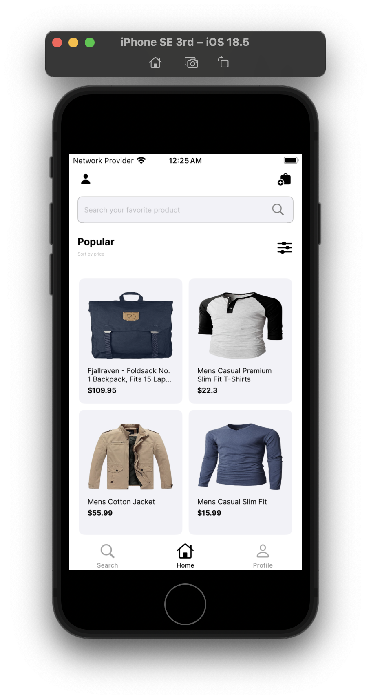
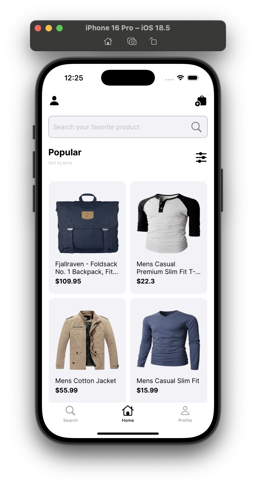
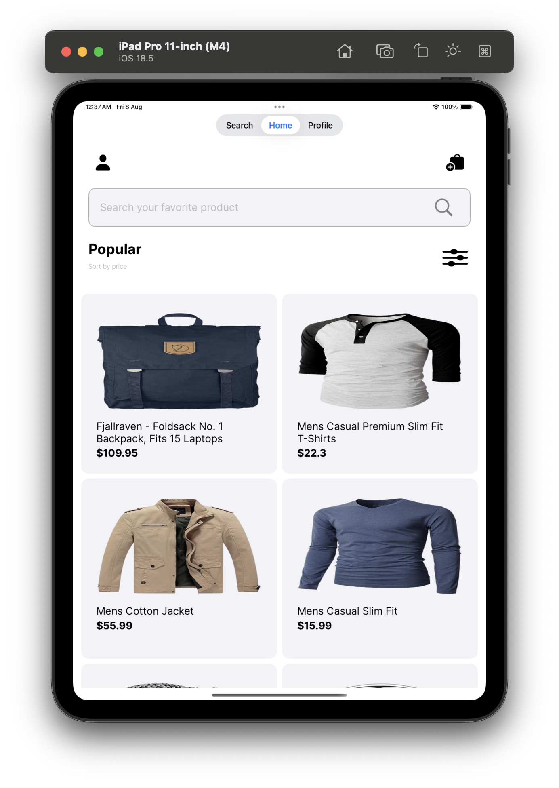

# 🛍️ Shopping-App-AdaptedConstraint-UIkit

A scalable and adaptive shopping application built using **UIKit + Storyboard**, focused on clean **MVVM architecture**, **generic API management**, and **adaptive UI constraints** for all screen sizes. This sample app demonstrates how to build reusable components and apply modern iOS best practices using UIKit.

---

## 🚀 Features

✅ Built with **UIKit** and **Storyboard**  
✅ Clean and maintainable **MVVM architecture**  
✅ **Generic API Manager** with reusable request handler  
✅ Reusable **networking**, **UI components**, and **helper utilities**  
✅ Adaptive layouts using **AutoLayout constraints**  
✅ Dynamic UI that fits from small to large screen devices  
✅ Organized file structure (View, ViewModel, Model, API, Helpers)  
✅ Easy to extend and integrate into real-world e-commerce flows  

---

## 📐 Adaptive UI

This app uses AutoLayout constraints in Storyboard to make the UI responsive across:

- iPhones (SE to Pro Max)
- iPads (Portrait/Landscape)
- Split screen and rotated modes

---

## 🧰 Tech Stack

- **Language**: Swift 5
- **UI Framework**: UIKit
- **Architecture**: MVVM (Model-View-ViewModel)
- **Networking**: URLSession with generic `APIManager`
- **Layout**: Storyboard with AutoLayout
- **Deployment Target**: iOS 13+

---

## 📸 Screenshots

<table>
  <tr>
    <td></td>
    <td></td>
    <td></td>
  </tr>
</table>


---


## 📦 Installation

1. Clone the repository  
   ```bash
   git clone https://github.com/Ajaykumar1d/Shopping-App-AdaptedConstraint-UIkit.git

